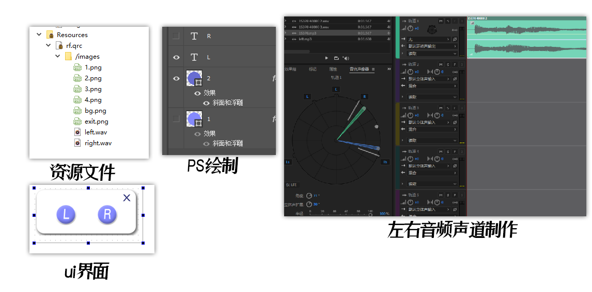
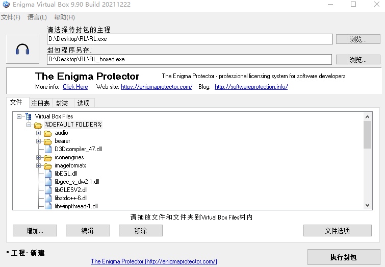

## 声道检测Sound Channel Detect

#### 项目灵感

​		因为我的耳机区分不出左右耳，打fps游戏的时候容易听错方向白给。

​		网上有声道检测的视频，可是每次要打游戏的时候还要去找视频太麻烦了，于是就想做一个小程序，方便我使用(我会尽早换耳机的)。

#### 基本要求

* **体积小，最好只有一个可执行程序**
* **操作简单**

#### 实现过程

​		用Qt写出基本框架，涉及新知识点:**资源文件的调用**、**按钮图片的替换**、**音频的播放**等。

​		利用万能的互联网，我很轻松的查到了如何解决上面的问题；

​		图片素材是用PS绘制的，音频文件是在站长素材下载的；

​		音频的左右声道是使用Au做的(后来试了一下Pr发现也能做到)；



#### 涉及的代码

* 按钮样式

```按钮qss样式
QPushButton:pressed{

border-image: url(:/images/4.png);  //按下状态

}

QPushButton {

border-image: url(:/images/2.png);  //正常状态

}
```

* 音频播放

  ```音频播放
  QSound::play(":/images/left.wav");
  ```

  (头文件:`#include<QSound>`) 注意：QSound不支持mp3格式的音频

***

完成项目编写并构建完毕，使用windeployqt命令给项目添加依赖；

使用**Enigma Virtual Box** 将项目封装，得到最终的程序效果。

